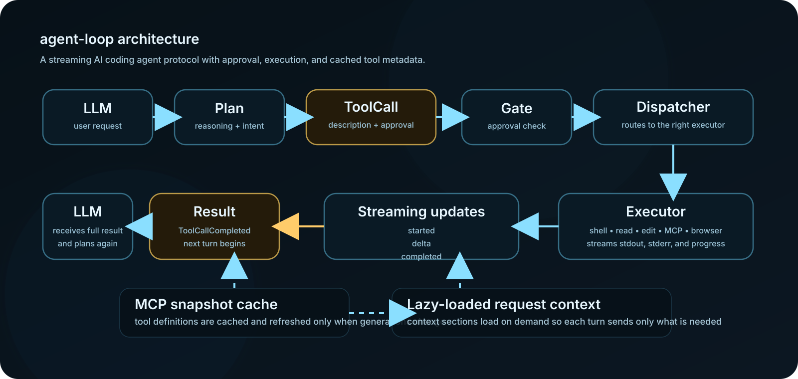
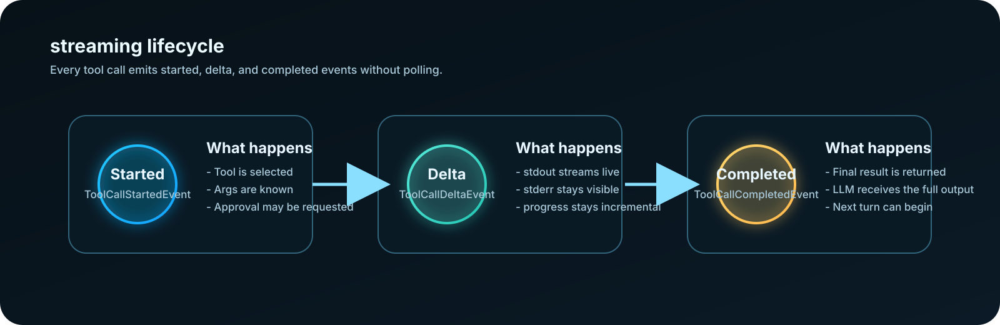

# agent-loop

A reference implementation of a streaming AI coding agent protocol.

Inspired by the architecture used by modern coding agents, `agent-loop` is designed to be readable, extensible, and a solid foundation for building your own AI coding tools.

## Architecture

<p align="center">
  
</p>

<p align="center">
  
</p>

Every tool call follows a streaming lifecycle:
1. `ToolCallStartedEvent` - about to run X
2. `ToolCallDeltaEvent` - incremental progress (stdout, stderr, thinking)
3. `ToolCallCompletedEvent` - final result

## Quick Start

```python
from agent_loop import Agent
from agent_loop.tools import ShellExecutor, ReadExecutor

agent = Agent()
agent.register_tool(ShellExecutor())
agent.register_tool(ReadExecutor())

for event in agent.run("list the current directory"):
    print(f"[{event.event_type}] {event.tool_name}")
    if event.data:
        print(f"  {event.data}")
```

## Tool Executors

| Tool | Name | Args | Streaming |
|------|------|------|-----------|
| **Shell** | `shell` | command, working_directory, timeout, env | ✅ stdout/stderr deltas |
| **Read** | `read` | path, offset, limit | No |
| **Edit** | `edit` | path, mode (str_replace/replace/stream_content) | No |
| **Web Fetch** | `web_fetch` | url, timeout, max_size | No |
| **Grep** | `grep` | pattern, path, file_glob, context | No |
| **Web Search** | `web_search` | query | No |

## Connecting an LLM

The base `Agent` is model-agnostic — you hand it a `tool_sequence` to replay.
To let a real model decide which tools to call, use `LLMAgent`, which drives a
call-and-respond loop against a provider of your choice. Pick a provider by
name and a model id:

```python
from agent_loop.llm import LLMAgent
from agent_loop.tools import ShellExecutor, ReadExecutor

agent = LLMAgent(
    provider="openrouter",                      # see list_providers()
    model="anthropic/claude-sonnet-4-6",
    executors=[ShellExecutor(), ReadExecutor()],
)

for event in agent.run("List the Python files and read the smallest one"):
    print(f"[{type(event).__name__}] {getattr(event, 'tool_name', '')}")
```

Providers are read from environment variables for their API keys. No extra
SDKs are needed — everything runs over `httpx` (already a dependency).

| Provider | Wire format | API key env var |
|----------|-------------|-----------------|
| `openai` | OpenAI chat | `OPENAI_API_KEY` |
| `openrouter` | OpenAI chat | `OPENROUTER_API_KEY` |
| `groq` | OpenAI chat | `GROQ_API_KEY` |
| `deepseek` | OpenAI chat | `DEEPSEEK_API_KEY` |
| `xai` | OpenAI chat | `XAI_API_KEY` |
| `mistral` | OpenAI chat | `MISTRAL_API_KEY` |
| `together` | OpenAI chat | `TOGETHER_API_KEY` |
| `fireworks` | OpenAI chat | `FIREWORKS_API_KEY` |
| `ollama` | OpenAI chat | _(local, none)_ |
| `anthropic` | Anthropic messages | `ANTHROPIC_API_KEY` |

Dangerous tool calls (flagged by `executor.needs_approval`) are denied unless
you pass `auto_approve=True` or an `approver=callable`. For tests and offline
demos, `ScriptedProvider` returns canned responses with no network:

```python
from agent_loop.llm import LLMAgent, ScriptedProvider, LLMResponse, LLMToolCall

provider = ScriptedProvider([
    LLMResponse(tool_calls=[LLMToolCall(id="1", name="shell", args={"command": "echo hi"})]),
    LLMResponse(text="the shell printed hi"),
])
agent = LLMAgent(provider=provider, model="demo", executors=[ShellExecutor()])
```

Run the full example (offline by default; set `LLM_PROVIDER`/`LLM_MODEL` for a real model):

```bash
python examples/llm_agent.py
```

## MCP Snapshot Cache

Caches MCP server tool definitions with **generation tracking** — only fetches from servers when their definitions change.

```python
from agent_loop.mcp import McpSnapshotCache

cache = McpSnapshotCache()
cache.register_server("sqlite")
cache.add_tool("sqlite", "query", {
    "name": "query",
    "description": "Run a SQL query",
    "inputSchema": {"type": "object", "properties": {}}
})
snapshot = cache.get_snapshot()
assert snapshot.checksum == cache.get_checksum("sqlite")
```

## Approval Gates

Three-tier security model (AUTO / PRE_CHECK / POST_CHECK) that gates tool calls based on risk classification:

```python
from agent_loop.approval import ApprovalGate

gate = ApprovalGate()
result = gate.evaluate("shell", {"command": "rm -rf /"})
assert result.status == "requires_approval"
```

## Context Builder

Lazy-loading context that defers expensive fetches until they're needed:

```python
from agent_loop.context import RequestContext

ctx = RequestContext()
ctx.set_git_diff("+new code")
ctx.set_environ({"PWD": "/workspace"})
payload = ctx.build()
```

## Agent Skills (from Cursor protocol)

Skills provide reusable, shareable agent instructions loaded at runtime:

```python
from agent_loop.skills import SkillRegistry

registry = SkillRegistry()
registry.load_skill("deploy", "Run `npm run build && npm run deploy`")
active = registry.for_tool("shell")
```

## License

MIT — use freely, build on it, ship it.
